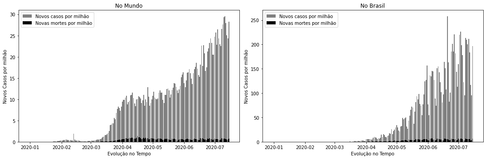

# Data_Science_COVID-19
Projeto realizado sobre COVID-19 com dataset da Our World in Data. O projeto nos mostra as limitações no dataset devido à diferença de registros entre países.

  

Alguns países registram apenas os testes positivos nos laboratórios públicos. No Brasil, realizam testes apenas em pacientes com comorbidades, no entanto, os dados de teste sequer são disponibilizados. Portanto, as correlações entre países torna-se inviável.

Por isso, finalizei as análises com o gráfico de evolução de COVID-19 comparando apenas as taxas de novos casos com a taxa de novas mortes. Desta forma, é possível perceber que embora haja aumento na taxa de novos casos, a taxa de novas mortes registradas no País e no Mundo não apresentam crescimento.

Tal notícia nos mostra que precisamos sim manter o isolamento na tentiva de conter o avanço de novos casos. Contudo, não devemos nos alarmar! O número de novas mortes proporcional à população não tem apresentado aumento. Por isso, é importante que caso haja algum sintoma, o paciente deve procurar o médico e seguir com o tratamento. Caso haja novo sintoma ou o caso não melhore, o paciente deve voltar ao médico quantas vezes forem necessárias. É preciso fazer o que tem que ser feito, sem pânico.
